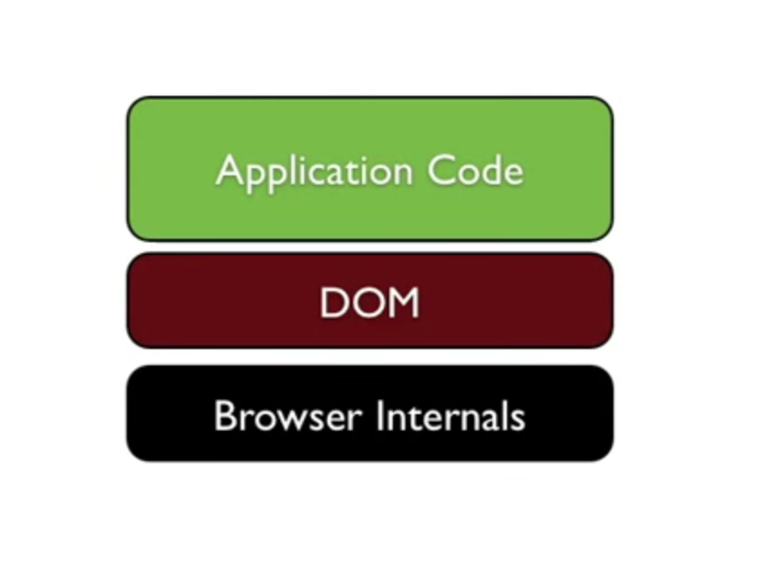
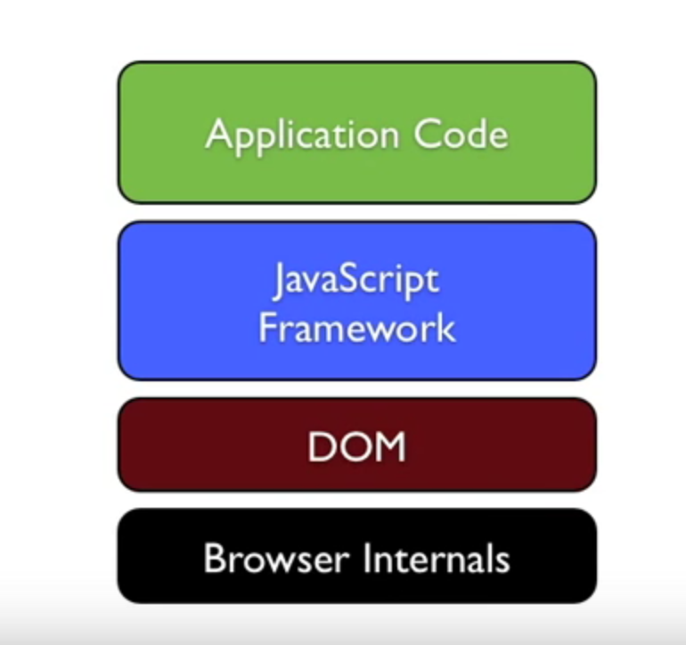
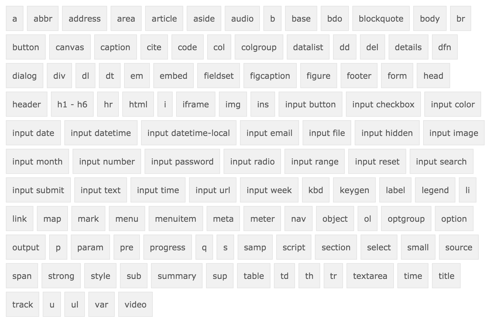

<!-- START doctoc generated TOC please keep comment here to allow auto update -->
<!-- DON'T EDIT THIS SECTION, INSTEAD RE-RUN doctoc TO UPDATE -->
**Table of Contents**  *generated with [DocToc](https://github.com/thlorenz/doctoc)*

- [DOM Tree](#dom-tree)
- [DOM Fetching](#dom-fetching)
- [DOM Events](#dom-events)
- [DOM Manipulation](#dom-manipulation)

<!-- END doctoc generated TOC please keep comment here to allow auto update -->

##DOM: Document Object Model
[TOC]

The Document Object Model (DOM) is a programming interface for HTML, XML and SVG documents. It provides a structured representation of the document as a tree.


**DOM != JAVASCRIPT**

> but it's quircky 

Most of the frustration arising from programming in the browser is a result of DOM INTERFACE implementation in different browsers rather than from javascript quirks! 

As a result we have a set of libraries and tools that provide an api to manipulate the DOM in a consistent away and cross-browser!


These tools account for differences between the different browsers and thus as we use them it helps us focus on our code rather than dealing with browser compatibility issues.



> [quirksmode.org](quirksmode.org) is the best place to learn about DOM quirks.

------------------------------------------------------------------

### DOM Tree
```
<html>
  <head>
  </head>
  <body>
    <p id="paragraph"></p>
    <div></div>
  </body>
</html>
```


>everything is a node, elements, comments, white space"


# All elements share common API

All elements share a common API, in HTML5 custom elements share the same common API by default.


## The Document Object

When an HTML document is loaded into a web browser, it becomes a **document object**.

The document object is the root node of the HTML document and the "owner" of all other nodes.

The document object provides properties and methods to access all node objects, from within JavaScript.


## Native elements have specific API

Native elements such as anchor tags, paragraphs, have specific API.




# Some of those API's

### DOM Fetching

```
var body = document.querySelector('body');
var paragraph = document.querySelector('#paragraph');

var pParent 	= paragraph.parentElement;
var pHtml 		= paragraph.innerHTML;
var pClassList 	= paragraph.classList;
```

### DOM Events

DOM can have event listeners.
click, hover, mouseenter, mouseleave, page load, good luck, etc.

```
function pClickHandler(e){
	console.log("Paragraph is clicked");
}
paragraph.onclick = pClickHandler;
```

 Nice and easy,
 but can only add one event listener!
 What if we want multiple listeners?
```
paragraph.addEventListener('click',  pClickHandler);
paragraph.addEventListener('click',  pClickHandler1);
paragraph.addEventListener('mouseenter',  elsa7mda7mboo);
paragraph.addEventListener('mouseleave',  elwaadTale3Laboo);
```

What about browser compatibility ? 

```
	function pClickHandler(e){
		alert("I AM CLICKED, bala kafya");
	}
	var paragraph = document.querySelector('#paragraph');
	if(paragraph.addEventListener){
		paragraph.addEventListener('click',  handler);
	} else if(paragraph.attachEvent){
		paragraph.attachEvent('onclick',  handler);
	}else {
		paragraph.onclick = handler;
	}
```

All this code to add one event listener?
i am a DRY programmer i don't write the same code twice...

```
function bind(element, event, callback){
	if(element.addEventListener){
		element.addEventListener(event, callback);
	} else if(element.attachEvent){
		element.attachEvent('on' + event,  callback);
	}else {
		element.['on' + event] = callback;
	}
}

var paragraph = document.querySelector('#paragraph');
bind(paragraph, 'click', function(e){
	console.log("inline function?");
})
// i would prefer something like
paragraph.on('click', function(){
	console.log("o el salamo 3alekom");
})

```

### DOM Manipulation

```
var count = 0;
paragraph.on('click', function(e){
	e.target.innerHTML = (++count) + " clicks";
})

paragraph.classList.add("hero");
setTimeout(function(){
	paragraph.remove();
}, 3000)
```