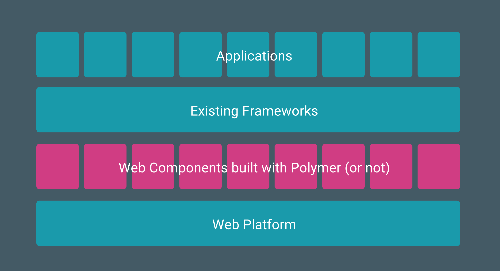

<!-- START doctoc generated TOC please keep comment here to allow auto update -->
<!-- DON'T EDIT THIS SECTION, INSTEAD RE-RUN doctoc TO UPDATE -->
**Table of Contents**  *generated with [DocToc](https://github.com/thlorenz/doctoc)*

- [Polymer](#polymer)
  - [What](#what)
  - [Why](#why)
  - [Who](#who)
  - [Usage](#usage)
  - [In depth](#in-depth)https://github.com/Yamsafer/frontend-talks/blob/master/polymer/readme.md#registration-&-lifecycle
  - ​
      - [Registration](#registration)
      - [Lifecycle](#lifecycle)
        - [Declared properties](#declared-properties)
        - [Events](#events)
        - [Data binding](#data-binding)
        - [Behaviors](#behaviors)
        - [Styling](#styling)
  - [Community Elements](#community-elements)

<!-- END doctoc generated TOC please keep comment here to allow auto update -->


## Polymer

### What
* Polymer is a library to help you build Web Components.
* Polymer is not a framework and it’s not trying to replace any existing frameworks.
* The very premise of web components is that they are not a framework



### Why
> The goal is to make it easier for you to build web components that you can use anywhere. Use them in an angular app, or a react app, or build your entire app out of components. That’s the dream!

### Who
Google.

### Usage

`bower install --save Polymer/polymer`

Anytime you create a new Polymer element, you’ll want to create an html file to hold its definition. 

Use HTML Imports, to load dependency elements inside the newly created element, and later we will use HTML Imports to import our element into the document where it will register itself as a new element inside the browser and be used.

```
<!-- date-format.html -->
<link rel=“import” href=“bower_components/polymer/polymer.html”>
<link rel=“import” href=“vendor/momentjs.html”>
<dom-module id=“date-format">
  <template>
        <style>
        /* CSS rules for your element */
        :host {
            display: block;
            font-weight : bold;
      color: grey;
        }
        </style>
        <!-- shadow/local DOM for your element -->
        <span> {{ dateFromatted }} </span> <!-- data bindings in local DOM -->
    </template>
  <script>
    // element registration
    Polymer({
      is: ‘date-format',
            // add properties and methods on the element's prototype
      properties: {
          // declare properties for the element's public API
        date: String,
        format: String,
          dateFormatted: String
      },
      ready : function(){
        var date = this.date;
        var format = this.format;
        this.dateFormatted = this._format(date, format);
      },
      _format : function(date, format){
    return moment(date).format(format);
    }
    });
  </script>
</dom-module>
```
use it
```
  <head>
    <script src="bower_components/webcomponentsjs/webcomponents.min.js"></script>

    <link rel=“import” href=“elements/date-format.html”>
  </head>
  <body>
    <date-format date="14-1-1989" format="MMM, DD"></date-format>
  </body>

```
result will be ishi zay hek
> **Jan, 14**

-------------------------------------------

### In depth

##### Registration

```javascript
// register an element
MyElement = Polymer({
  is: 'my-element',
  created: function() {
    this.textContent = 'My element!';
  }
});
```

> By specification, the custom element’s name **must contain a dash (-)**.

use in document

`<my-element></my-element>`

or in javascript with the constructor

`var myEl = new MyElement();`

* The `Polymer` function registers the element with the browser and returns a constructor that can be used to create new instances of your element via code.
* The `Polymer` function sets up the prototype chain for your custom element, chaining it to the Polymer`Base` prototype.
* use [behaviors](#behaviors) to share code between elements.


We can as well extend native elements (later will be able to extend custom-elements as well)

```
MyInput = Polymer({
  is: 'my-input',
  extends: 'input',
  created: function() {
    this.style.border = '1px solid red';
  }
});
```

```
<input is="my-input">
```

##### Lifecycle

```
MyElement = Polymer({
  is: 'my-element',
  created: function() {
	// Use instead of createdCallback.
	// Called when the element has been created
    // Before property values are set and shadow/local DOM is initialized.
  },
  ready: function() {
	// Called after property values are set and local DOM is initialized.
  },
  attached: function() {
  	// Use instead of attachedCallback.
	// Called after the element is attached to the document. 
    // ex. Access computed dom styles, add document-level event listeners
  },
  detached: function() {
    // Use instead of detachedCallback.
    // Called after the element is detached from the document.
  },
  attributeChanged: function(name, type) {
	// Called when one of the element's attributes is changed.
  }

});
```

In a document dom-tree, elemens are usually initialized in order

consider the following example

```
<avatar-list>
  <my-photo class="photo" src="one.jpg">First photo</my-photo>
  <my-photo class="photo" src="two.jpg">Second photo</my-photo>
</avatar-list>
```

>  `<avatar-list> ` is *likely* to have its `ready` method called before `<my-photo> ` `ready` method.

What about siblings like `<my-photo>` ?

> There are no guarantees with regard to initialization timing between sibling elements.


####Local dom

##### Shady DOM

As shadow-dom is part of the web components specifications, when we build a custom element, it's content should be expressed in shadow dom, but as browser vendors are still in the process of implmenting these specifications, and as shadow dom is hard to polyfill for the following reasons

It’s a lot of code.
- It’s slow to indirect all the DOM API.
- Structures like `NodeList` can simply not be emulated.
- There are certain accessors that cannot be overwritten (for example, `window.document`,`window.document.body`).
- The polyfill returns objects that are not actually Nodes, but Node proxies, which can be very confusing.

The good ladies and gentlemen at google gave birth to Shady DOM.

> Roughly speaking, shady DOM provides a shadow DOM compatible form of tree scoping. 
>
> The upshot is that shady DOM provides enough tree-scoping for Polymer to act as if shadow DOM is available on all platforms, without compromising performance.

The downside of shady DOM now is that it still leaks, and might lead to messy css and all the negative points we used to describe traditional solutions.

But the bright side is that if we use the shady DOM api to look at the custom-element, it wil look the same as if we are dealing with a shadow-dom, this helps nowadays project adapt the concept of web components and start using it for production applications, and later when Polymer change to use shadow-dom by default (when the browsers are ready) your code wil be the same, but instead of using shady, you will be using shadow without changing code, because shady is built to mimic shadow, they are compatible.

and so because of the confusion that arises from these two implementations, the ladies and gentlemen at google (creators of polymer) decided to call the dom that is encapsulated inside a custom element **local DOM**.

note that as we call the DOM encapsulated inside the custom-element 

**shadow**-dom, we call the DOM elements that are children of the element

**light**-dom.

note: we can set polymer to use shadow-dom when available by the browser.

##### Defining local dom

Using a `<template>` inside a  `<dom-module>` element with an `id` that matches the `is` property of a custom element will make this template be the custom element's local DOM.

```html
<dom-module id="x-foo">
  <template>I am x-foo!</template>
  <script>
    Polymer({
      is: 'x-foo'
    });
  </script>
</dom-module>
```


> We say that an element definition has an imperative and declarative portion. The imperative portion is the call to `Polymer({...})`, and the declarative portion is the`` element. The imperative and declarative portions of an element’s definition may be placed in the same html file or in separate files.

##### Finding/Accessing local dom

Polymer provides methods to access local dom.

```javascript
<dom-module id="x-custom">
  <template>
    Hello World from <span id="name"></span>!
  </template>
  <script>
    Polymer({
      is: 'x-custom',
      ready: function() {
        // to access statically created local dom
        this.$.name.textContent = this.tagName;
        
        // to access dynamically created local dom you can do 
        // this.$$(selector)
        // returns the first node in the local DOM that matches selector.
      }
    });
  </script>
</dom-module>
```

##### Light Dom

Think of the following example

```html
<type-me>
  <h1> The title of all titles </h1>	
  <p>Lorem ipsum dolor sit amet, consectetur adipisicing elit, 		seddoeiusmod.</p>
</type-me>
```

how can we access the `h1` and `p` from inside the custom-element,

remember that we are now living inside the elements rather than outside of it.

 `h1` & `p` elements are called the **Light DOM** of the custom element, as they are the ones in the light, not in the **shadow**.


> In shadow DOM, the browser maintains separate light DOM and shadow DOM trees, and creates a merged view (the *composed tree*) for rendering purposes.
>
> In shady DOM, Polymer maintains its own light DOM and shady DOM trees. The document’s DOM tree is effectively the composed tree.

In shady DOM, Polymer maintains its own light DOM and shady DOM trees. The document’s DOM tree is effectively the composed tree.


```html
<template>
  <header>Local dom header followed by distributed dom.</header>
  <content select="h1"></content>
  <content></content>
</template>
```

##### Shady DOM API

Part of the shady DOM is the API that polymer provides for manipulating the dom.

and as noted by the Polymer team

> **Note:** All DOM manipulation must use this API, as opposed to DOM API directly on nodes.


#### Declared properties


#### Events


#### Data binding


#### Behaviors


#### Styling

------------------------

### Community Elements
* Elements Catalog
* Customelemtns.io