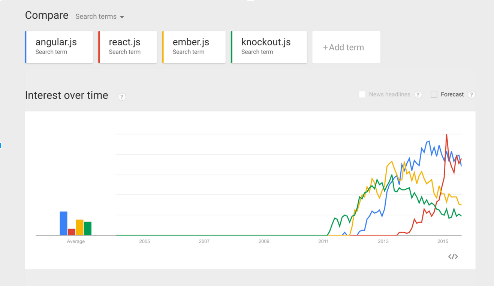
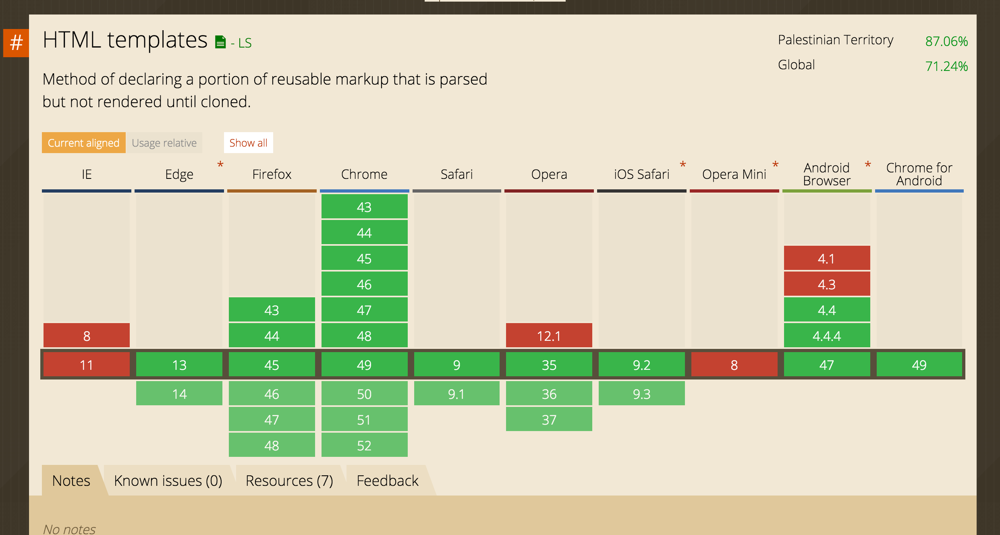
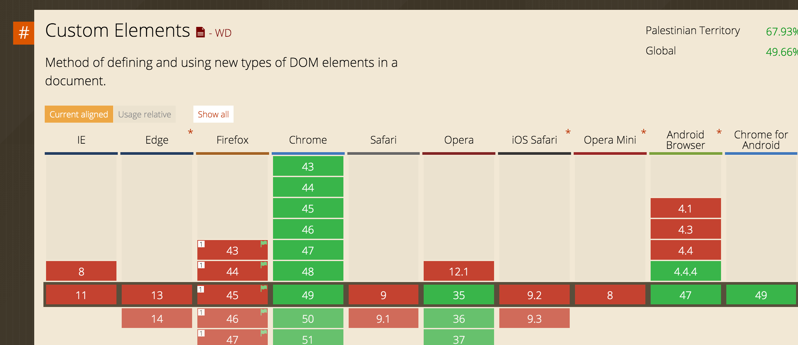

<!-- START doctoc generated TOC please keep comment here to allow auto update -->
<!-- DON'T EDIT THIS SECTION, INSTEAD RE-RUN doctoc TO UPDATE -->
**Table of Contents**  *generated with [DocToc](https://github.com/thlorenz/doctoc)*

    - [Abundance of choice](#abundance-of-choice)
    - [Web Components Specs](#web-components-specs)
      - [Template](#template)
        - [What](#what)
- [Frontend Talks](#frontend-talks)
        - [WHY](#why)
        - [Usage](#usage)
        - [Browser Support](#browser-support)
      - [HTML IMPORTS](#html-imports)
        - [What](#what-1)
        - [WHY](#why-1)
        - [USAGE](#usage)
        - [Browser Support](#browser-support-1)
      - [Custom Elements](#custom-elements)
        - [What](#what-2)
        - [WHY](#why-2)
        - [Browser Support](#browser-support-2)
      - [SHADOW DOM](#shadow-dom)
        - [What](#what-3)
        - [Why](#why)
        - [USAGE](#usage-1)
        - [Browser Support](#browser-support-3)

<!-- END doctoc generated TOC please keep comment here to allow auto update -->

##Web Components

[TOC]

### Abundance of choice
It feels like every 6 months to a year there is some new framework we have to learn.



- Lots of frameworks,
- Notion of **components**,
- **they don’t work together**.

There i still hope for humanity

 A few years ago, engineers who work on the browsers got together to figure out, what are the best features of the frameworks and can we make them part of the browser. That way you don’t have to rewrite your code every 6 months.

The result was
### Web Components Specs
Web Components are low-level primistives that let you define your own HTML Elements.

In the past, a new tag would be invented, and then we had to wait for it to ship in every browser, now we can invent these tags, and share them.


There are four specs that make up web components

1. [Template](#template)
2. [Shadow Dom](#shadow-dom)
3. [HTML Imports](#html-imports)
4. [Custom elements](#custom-elements)

We will discuss each component in details later, 

But what about browser support for these new specifications now? 
> A lot of progress has been made since the introduction of the Web Components back in 2011. All major browsers have started implementation of the technologies needed to run web components natively. While browser vendors are still working on native implementations, libraries have been able to use a polyfill to make web components available to developers already.
 
 The webcomponent.js polyfills enable Web Components in (evergreen) browsers that lack native support.

`<script src="bower_components/webcomponentsjs/webcomponents.min.js" </script>`


#### Template
##### What
Templates allow you to declare fragments of markup which are parsed as HTML, go unused at page load, but can be instantiated later on at runtime.
```
<template id="template">
  <div>
    <h1>Frontend Talks</h1>
    
  </div>
</template>
```
##### WHY
As the landscape of web architecture is changing, and as the MVC model is not anymore bound by server frameworks only, and with the rise of client-side javascript framworks that compiles and render views on the user-agent, and as it's a shame if we move forward doing client side templating using such syntax

```
<script type="text/template">
  <div>
    <h1>Web Components</h1>
    
  </div>
</script>
```
##### Usage
```
<template id="template">
  <div>
    <h1>Frontend Talks</h1>
    
  </div>
</template>
<script>
  var template = document.querySelector('#template');
  // deep clone
  var clone = document.importNode(template.content, true);
  var host = document.querySelector('#host');
  host.appendChild(clone);
</script>
```
##### Browser Support


#### HTML IMPORTS
##### What
HTML Imports are a way to include and reuse HTML documents in other HTML documents

##### WHY 
 Imports provide convention for **bundling HTML/CSS/JS** (even other HTML Imports) into a single deliverable. It's an intrinsic feature, but a powerful one. If you're creating a theme, library, or just want to **segment your app** into logical chunks, giving users a single URL is compelling. Heck, you could even **deliver** an entire app via an import. Think about that for a second.


##### USAGE
```
<head>
  <link rel="import" href="/path/to/imports/stuff.html">
</head>
```

##### Browser Support
> add content

#### Custom Elements
##### What
A custom element is an element whose constructor and prototype are defined by a developer, instead of by the user agent. 


##### WHY

1. Provide a way for Web developers to build their own, fully-featured DOM elements.
Although it was long supported to create any element you want on the html page, this feature was not very functional, inform the4 parser on how to properly construct an element and to react to life cycle changes of an element.

2. Rationalize the platform.
HTML elements explain the functionality of existing Web platform features.
Rationalize all HTML, SVG and MathML, elements into one coherent system.
##### USAGE

Extending an existing element class (ex. native elements)
```
   document.defineElement("x-foo", class XFoo extends HTMLElement {
        constructor() {
            super();
            this._initialData = "foo";
        }
    });

```
then use it in javascript

`var foo = document.createElement("x-foo");`

or in html

`<x-foo></x-foo>`

##### Browser Support



#### SHADOW DOM
##### What
##### Why
##### USAGE
##### Browser Support